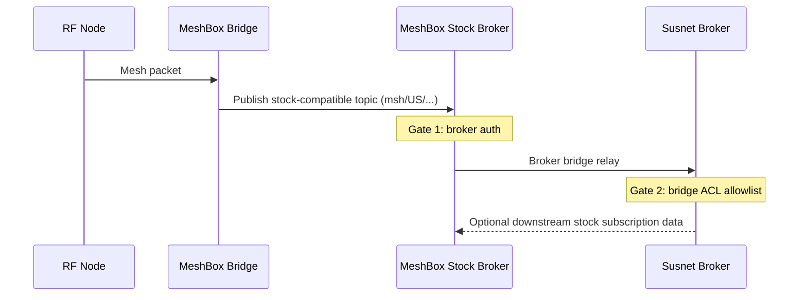
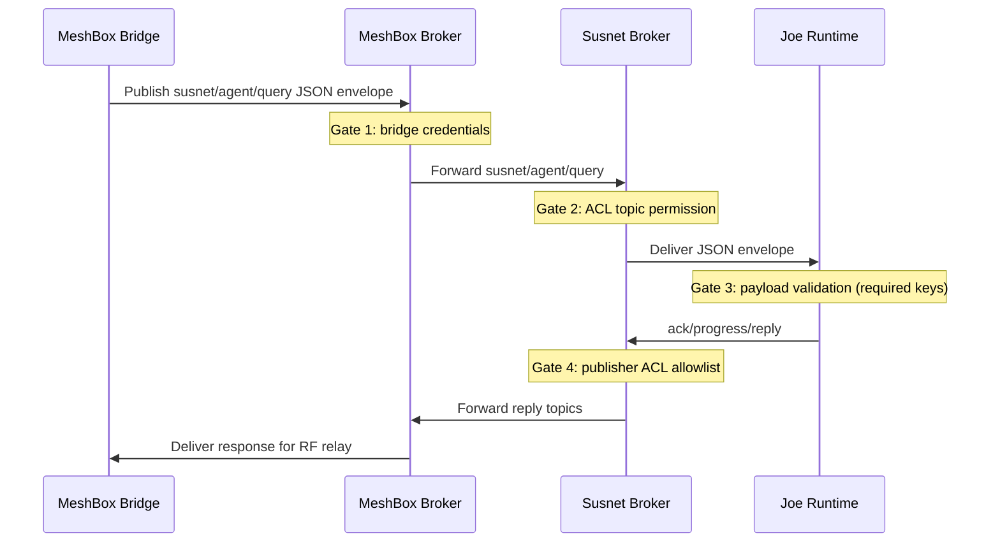

# Message Flows (Susnet)

## Flow A: Mesh Radio -> Stock Meshtastic MQTT Path

## Flow B: MeshBox Custom Broker -> Susnet Agent/Joe

## Failure Handling
- Auth failure: broker rejects client session.
- ACL failure: publish/subscribe denied; no relay.
- Schema failure: Joe rejects malformed payload and emits error path.
