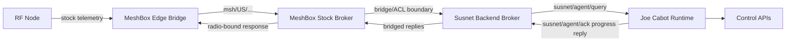

# Susnet System Map

## Purpose
This map defines how Susnet participates in the private-first documentation model and how it relates to MeshBox and public `resevoir-pis` docs.

## Component Taxonomy
- RF Node: Meshtastic radio node(s) on the mesh.
- Edge Bridge: MeshBox Meshtastic bridge that converts radio traffic into MQTT events.
- Stock MQTT Path: strict Meshtastic-compatible payload/topic flow rooted at `msh/US/...`.
- Custom Agent Path: MeshBox-to-Susnet query/reply flow on `susnet/agent/*` topics.
- Susnet Broker: backend Mosquitto that enforces local broker identities and ACLs.
- Joe Runtime: `joe-cabot-lite` service that handles validated custom queries.
- Control APIs: Susnet web and automation surfaces that consume Joe outputs.

## Relationship Map

## Linked Specs
- [Component Boundaries](component-boundaries.md)
- [Permission Gates Matrix](permission-gates-matrix.md)
- [Message Flows](message-flows.md)
- [Stock Meshtastic MQTT Contract](../contracts/stock-meshtastic-mqtt-contract.md)
- [Custom MeshBox-Susnet Agent Contract](../contracts/custom-meshbox-susnet-agent-contract.md)
- [Change Impact Matrix](../CHANGE_IMPACTS.md)
