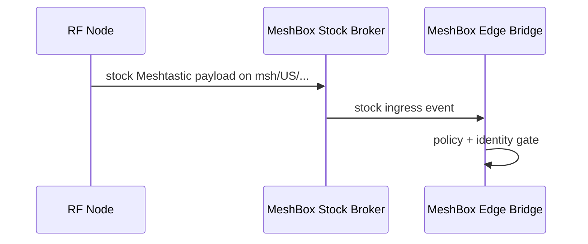
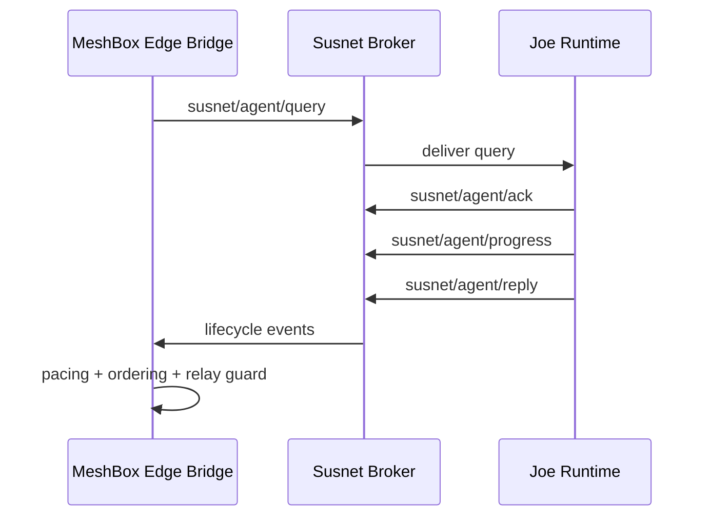

# Message Flows

## Flow A: Mesh Radio -> MeshBox Stock Broker Path

## Flow B: MeshBox Custom Broker -> Susnet Agent/Joe Path

## Explicit Gate Points
1. Broker authentication.
2. Topic ACL enforcement.
3. Edge policy allow/deny.
4. Control runtime schema and safety checks.
5. Outbound chunk ordering and pacing.
