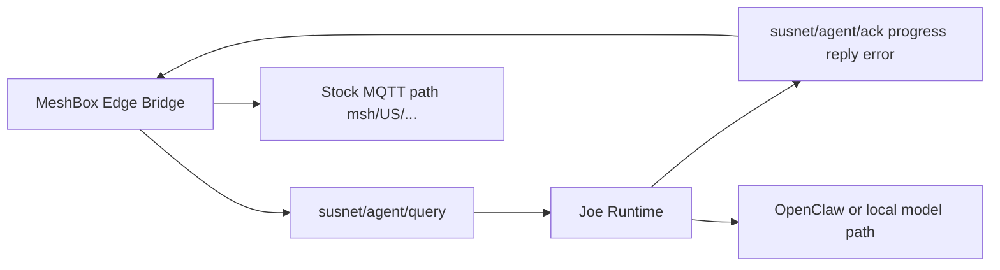

# Susnet System Map

## Purpose
This is the private canonical system map for control-host architecture and cross-host coordination with MeshBox.

## Component Taxonomy
- Control broker and lifecycle topics
- Control runtime (`real-joe`, fallback runtime)
- Edge bridge integration boundary
- Documentation and governance boundary

## Relationship Map

## Linked Docs
- [Component Boundaries](component-boundaries.md)
- [Permission Gates Matrix](permission-gates-matrix.md)
- [Message Flows](message-flows.md)
- [Cross-Host Component Map](cross-host-component-map.md)
- [Surface: Stock Meshtastic](surfaces/stock-meshtastic.md)
- [Surface: Edge Bridge Mr. Pink](surfaces/edge-bridge-mr-pink.md)
- [Surface: Control Runtime Joe OpenClaw](surfaces/control-runtime-joe-openclaw.md)
- [Surface: Permission Gates](surfaces/permission-gates.md)
